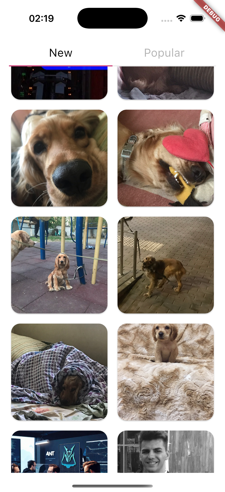
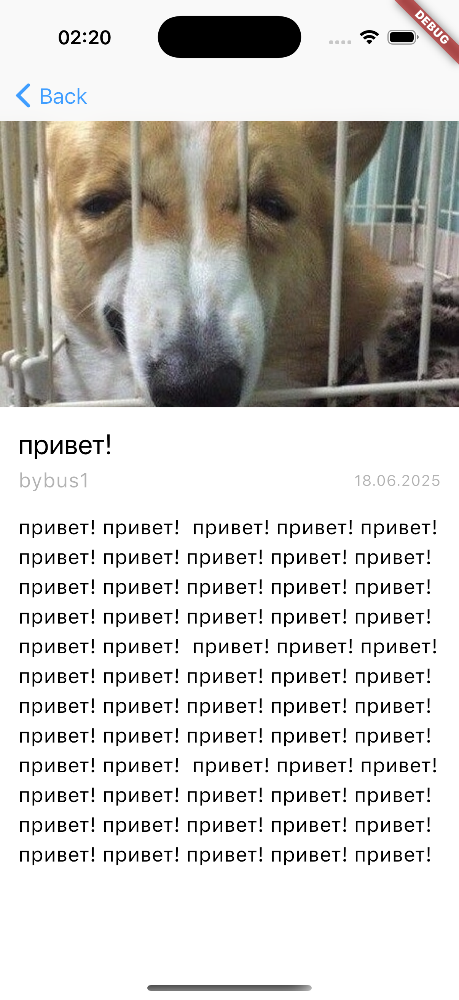
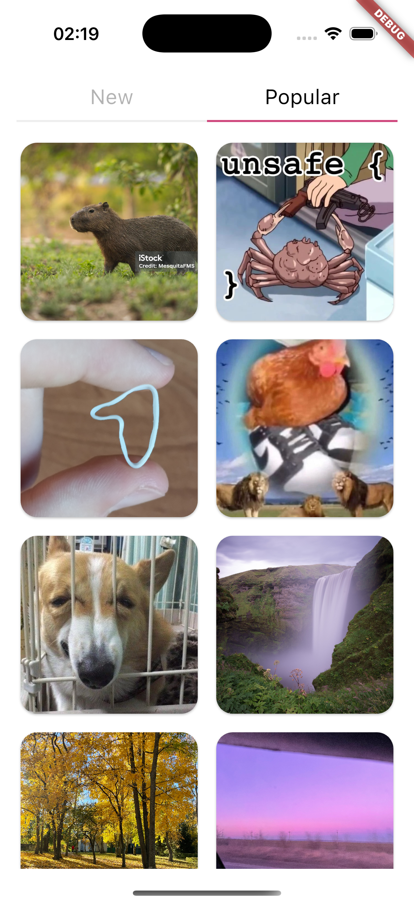
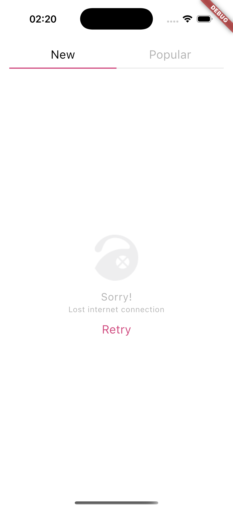
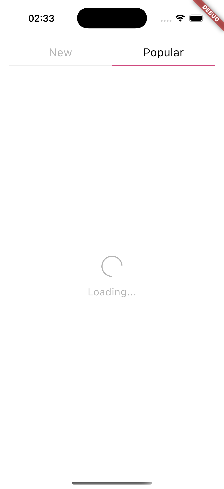

# Тестовое задание

## Используемые технологии
- Flutter
- Dart
- Bloc
- Dio
- internet_connection_checker_plus, cached_network_image, flutter_cache_manager_dio, flutter_cache_manager

## Описание архитектуры

Проект поделен на фичи и базовую папку с общими сущностями и базовыми сервисами(проверка интернет соединения, api, кеширование изображений). Каждая фича разделена на 3 слоя(domain, data, presentation).
- domain - самый независимый слой(там располагаются сущности бизнес логики и интерфейсы репозиториев)
- data - слой доступа к данным (сами репозитории и модельки)
- presentation - слой ui(виджеты, экраны и блок)

Общие сущности вынесены в core/, они используются во всем проекте

Общение между блоком и репозиторием происхоsдит через интерфейс между ними. Это гарантирует, что бизнес логика будет независима от того как реализован каждый конкретный репозиторий.

## Описание функционала

- 2 таба (новые и популярные) для списков картинок
- Деталка картинки
- Пагинация для списков
- Проверка интернет соединения и отображение в случае его отсуствтвия соответствующего сообщения
- Pull-to-refresh

## Скрины

<div align="center">
    
    
    
    
    
</div>

## Get started
```sh
   flutter pub get
   dart run build_runner build
```
